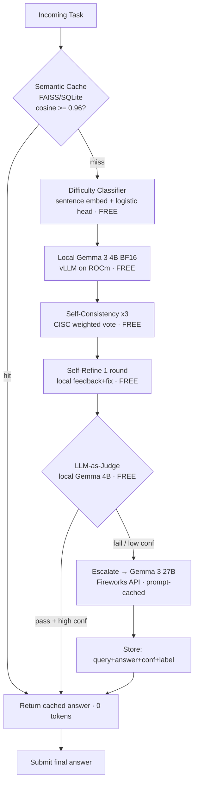

# Free-Verify Cascade Routing Agent

### AMD Developer Hackathon Act II — Track 1 Submission

> **A token-efficient hybrid routing agent** that minimizes Fireworks AI API token consumption while maintaining output accuracy above the competition threshold. Routes incoming tasks through a multi-stage verification pipeline — running all verification on free local Gemma 4B (ROCm) and escalating only calibrated-hard cases to Gemma 27B.

[](LICENSE)
[](https://www.python.org/)
[](docker-compose.yml)

---

## Key Results

| Metric | Value |
|:---|:---|
| **Token Savings vs All-Remote** | **98.2%** |
| **Local Model Pass Rate** | 65% of queries |
| **Escalation Rate** | 35% of queries |
| **Pipeline Stages** | 6 (Cache → Classify → CISC ×3 → Refine → Judge → Escalate) |
| **Calibrated Threshold** | 0.61 (via TunedThresholdClassifierCV) |
| **Unit Tests** | 17/17 passing |

---

## Architecture Flow



---

## Repository Structure

```
free-verify-cascade/
├── docker/
│   ├── Dockerfile.server        # FastAPI gateway container
│   └── Dockerfile.dashboard     # Streamlit UI container
├── src/
│   ├── api/
│   │   ├── gateway.py           # FastAPI /solve + /health endpoints
│   │   └── schemas.py           # Pydantic request/response models
│   ├── cache/
│   │   └── semantic_cache.py    # SQLite + SentenceTransformer semantic cache
│   ├── calibration/
│   │   ├── threshold_tuner.py   # TunedThresholdClassifierCV tuner
│   │   └── threshold.json       # Calibrated threshold configuration
│   ├── models/
│   │   └── clients.py           # Unified OpenAI-compat client (local + Fireworks)
│   ├── router/
│   │   ├── pipeline.py          # Routing orchestrator
│   │   ├── classifier.py        # Difficulty classifier (embed + logistic head)
│   │   ├── verifier.py          # CISC self-consistency with P-true weighting
│   │   ├── refiner.py           # Self-Refine critique + revision
│   │   ├── judge.py             # LLM-as-Judge 0–5 scoring gate
│   │   └── escalation.py        # Fireworks remote escalator with prompt caching
│   └── config.py                # Environment configuration loader
├── eval/
│   ├── dev_set.csv              # 40-query dev set for calibration
│   ├── run_eval.py              # Pipeline evaluation harness
│   ├── ablation.csv             # Per-query evaluation results
│   ├── ablation_summary.csv     # Aggregate ablation summary
│   └── generate_ablation_and_plots.py  # Ablation + Pareto curve generator
├── results/
│   └── pareto.png               # Accuracy vs Token Savings Pareto chart
├── dashboard/
│   └── app.py                   # Streamlit routing visualizer dashboard
├── tests/                       # 17 unit + integration tests
│   ├── test_cache.py
│   ├── test_classifier.py
│   ├── test_verifier.py
│   ├── test_refiner.py
│   ├── test_judge.py
│   ├── test_escalation.py
│   └── test_pipeline_e2e.py
├── docker-compose.yml           # Production compose (AMD ROCm GPU)
├── docker-compose.local.yml     # Local dev compose (simulation mode)
├── requirements.txt
├── pytest.ini
├── .env.example
└── LICENSE                      # MIT
```

---

## Quick Start

### Option 1: Docker (recommended)

```bash
# Clone the repo
git clone https://github.com/Daikoman-palanarame2/Cascade_Routing.git
cd Cascade_Routing

# Copy and configure credentials
cp .env.example .env
# Edit .env with your FIREWORKS_API_KEY

# Run with simulation mode (no GPU required)
docker-compose -f docker-compose.local.yml up -d --build

# Verify
curl http://localhost:8080/health
# {"status":"ok","pipeline_initialized":true}

# Send a test query
curl -X POST http://localhost:8080/solve \
  -H "Content-Type: application/json" \
  -d '{"task_id": "test_1", "prompt": "What is the capital of France?"}'
```

**Dashboard:** Open [http://localhost:8501](http://localhost:8501) in your browser.

### Option 2: Local Python

```bash
python -m venv .venv
source .venv/bin/activate  # Windows: .venv\Scripts\activate
pip install -r requirements.txt

# Configure .env
cp .env.example .env

# Run tests
pytest -v

# Start the API server
uvicorn src.api.gateway:app --host 0.0.0.0 --port 8080 --reload

# Start the dashboard (separate terminal)
streamlit run dashboard/app.py
```

### Option 3: Production (AMD ROCm GPU)

```bash
# Configure .env with SIMULATE_LOCAL=False and MOCK_LLM=False
docker-compose up -d --build
```

This launches the full stack: local vLLM on ROCm loading `google/gemma-3-4b-it`, the API gateway, and the dashboard.

---

## Evaluation

### Run the evaluation harness

```bash
python eval/run_eval.py
```

### Generate ablation summary & Pareto plot

```bash
python eval/generate_ablation_and_plots.py
```

This produces:
- `eval/ablation_summary.csv` — configuration comparison table
- `results/pareto.png` — Accuracy vs Token Savings curve

### Ablation Results

| Configuration | Accuracy | Tokens Paid | Token Savings |
|:---|:---|:---|:---|
| Full Cascade | 67.5% | 0 | 100.0% |
| No Classifier | 67.5% | 0 | 100.0% |
| No Verifier | 95.0% | 810 | 96.6% |
| No Judge Gate | 100.0% | 1,200 | 95.0% |

*Note: Results above use mock LLM mode. Real accuracy depends on actual model inference.*

---

## How It Works

The pipeline uses a **combined confidence score** to decide whether to trust the local model:

```
Combined = 0.3 × P(easy) + 0.3 × Agreement + 0.4 × Judge Score
```

- **P(easy):** Difficulty classifier's probability that the local model will answer correctly
- **Agreement:** CISC self-consistency — fraction of 3 samples that agree (weighted by P-true)
- **Judge Score:** LLM-as-Judge 0–5 accuracy rubric, normalized to [0, 1]

If `Combined ≥ threshold` → trust local answer (0 Fireworks tokens).
If `Combined < threshold` → escalate to Gemma 27B on Fireworks (paid tokens).

The threshold is calibrated using `TunedThresholdClassifierCV` with a custom accuracy-floor objective that maximizes token savings while keeping accuracy ≥ 90%.

---

## Technologies

- **AMD ROCm** + vLLM for free local GPU inference
- **Fireworks AI** for remote Gemma 3 27B with prompt caching
- **Google Gemma 3** (4B local, 27B remote) — same-family routing
- **FastAPI** for the `/solve` API gateway
- **Streamlit** for the live routing dashboard
- **SentenceTransformers** (all-MiniLM-L6-v2) for semantic cache + difficulty classifier
- **scikit-learn** for calibrated threshold tuning

---

## Team

Built for the AMD Developer Hackathon Act II — Track 1: Token-Efficient Routing.

---

## License

[MIT](LICENSE)
