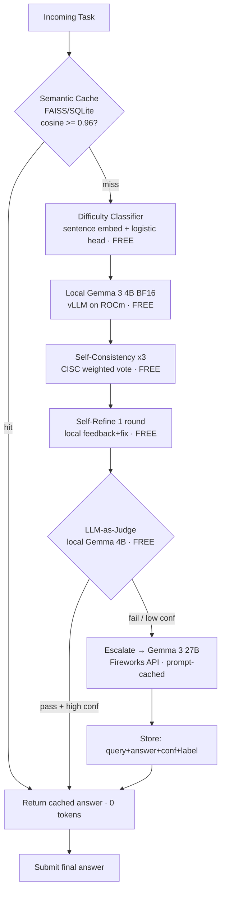

# Free-Verify Cascade Routing Agent
### AMD Developer Hackathon Act II — Track 1 submission

This repository implements a **token-efficient hybrid routing agent** designed to minimize Fireworks AI API token consumption while maintaining output accuracy above the competition threshold. It routes incoming tasks through a multi-stage pipeline, running all verification steps on local free tokens (or simulated local tokens), escalating to remote Fireworks models only for hard queries.

---

## Architecture Flow



---

## Repository Structure

```
free-verify-cascade/
├── docker/
│   ├── Dockerfile.server        # FastAPI gateway container
│   └── Dockerfile.dashboard     # Streamlit UI container
├── src/
│   ├── api/
│   │   ├── gateway.py           # FastAPI /solve endpoint
│   │   └── schemas.py           # Pydantic task schema models
│   ├── cache/
│   │   └── semantic_cache.py    # SQLite/SentenceTransformer semantic cache
│   ├── calibration/
│   │   ├── threshold_tuner.py   # TunedThresholdClassifierCV tuner
│   │   └── threshold.json       # Calibrated threshold configuration
│   ├── models/
│   │   └── clients.py           # Unified client wrapper for local & Fireworks
│   ├── router/
│   │   ├── pipeline.py          # Routing orchestrator
│   │   ├── classifier.py        # Difficulty classifier
│   │   ├── verifier.py          # CISC self-consistency logic
│   │   ├── refiner.py           # Self-Refine critiques
│   │   ├── judge.py             # LLM-as-judge scoring
│   │   └── escalation.py        # Fireworks Remote Escalator
│   └── config.py                # Environment configuration settings
├── eval/
│   ├── dev_set.csv              # Calibration and dev set tasks
│   └── run_eval.py              # Dev set pipeline evaluation runner
├── dashboard/
│   └── app.py                   # Streamlit routing visualizer dashboard
├── tests/                       # Unit and integration tests
├── requirements.txt             # Python packages
├── docker-compose.yml           # Multi-container local orchestration
└── .env                         # API credentials and settings
```

---

## Local Setup

### 1. Install Dependencies
Initialize a virtual environment and install the required Python packages:
```bash
python -m venv .venv
source .venv/bin/activate  # On Windows: .\.venv\Scripts\activate
pip install -r requirements.txt
```

### 2. Configure Environment Variables
Copy and set up your API credentials in your `.env` file:
```env
FIREWORKS_API_KEY=your_fireworks_api_key_here
HF_TOKEN=your_hugging_face_token_here
SIMULATE_LOCAL=True
```
*Note: Setting `SIMULATE_LOCAL=True` permits running the local model components using a cheap API model on Fireworks (e.g. `google/gemma-3-4b-it`) so that you can run and test the complete pipeline on standard machines without a local GPU.*

---

## Usage

### Run Unit and Integration Tests
```bash
pytest tests/ -v
```

### Calibrate Escalation Threshold
Run the threshold tuner on the dev set to find the optimal escalation cutoff:
```bash
python src/calibration/threshold_tuner.py
```

### Run Evaluation Harness
Run the entire pipeline on the dev set to compute token savings against the all-remote baseline:
```bash
python eval/run_eval.py
```

### Start the API Gateway Server
Run the FastAPI gateway locally:
```bash
uvicorn src.api.gateway:app --host 0.0.0.0 --port 8080 --reload
```

### Launch the Streamlit Dashboard
Run the visualizer dashboard to issue prompts interactively and trace decision paths:
```bash
streamlit run dashboard/app.py
```
*Access the dashboard at `http://localhost:8501`*

---

## Deployment (AMD GPU environment)

To run the full stack containerized on an AMD Instinct/ROCm platform, configure `.env` with `SIMULATE_LOCAL=False` and launch:
```bash
docker-compose up -d --build
```
This launches a local `vllm-local` container loading `google/gemma-3-4b-it` on ROCm alongside the API and dashboard services.
